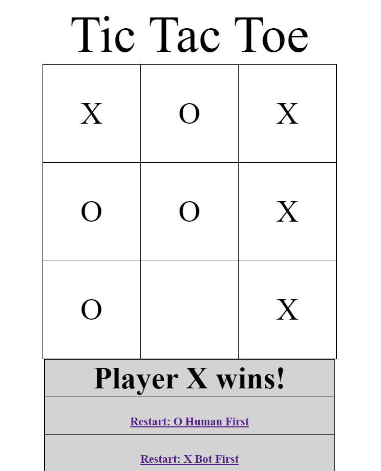

# TicTacToe_Web
A single-player Tic Tac Toe web game developed using Python FastAPI, HTML and CSS. The player will be playing against a bot (the Minimax algorithm). The player can choose whether to go first or not.

### Installation:
In a Conda environment, install the required libraries:\
`pip install -r requirements.txt`

Run `main.py` using the command:\
`uvicorn main:app --reload`

Wait until the following messages appear:
```
Uvicorn running on http://127.0.0.1:8000
...
Application startup complete.
```

In a web browser, enter the local server that appears in the output:\
`http://127.0.0.1:8000`

### Screenshot:


